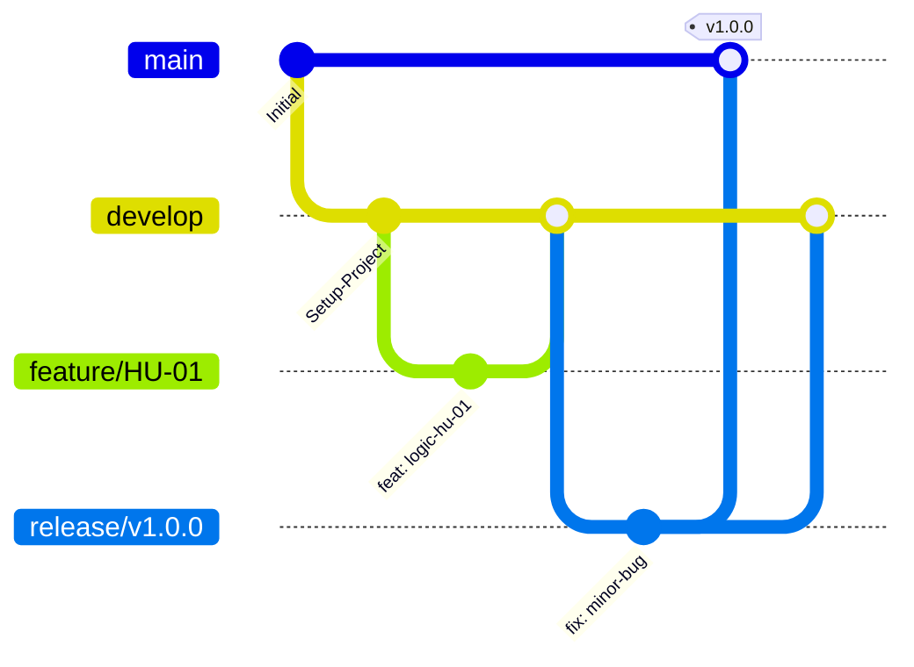

# AgroValle Connect

Plataforma web que conecta directamente a los productores agrícolas del Valle del Cauca con la demanda comercial urbana, eliminando la intermediación innecesaria en la cadena de comercialización.

## Declaración de Visión del Producto

> Para **productores agrícolas del Valle del Cauca**, que **necesitan vender directamente a comerciantes y restaurantes sin intermediarios**, **AgroValle Connect** es **una plataforma web desarrollada en Java 17 / Spring Boot**, que **conecta la oferta agrícola con la demanda comercial urbana a precio justo y en tiempo real**. A diferencia de **los intermediarios tradicionales y las cadenas de comercialización largas**, nuestro producto **garantiza trazabilidad logística, transparencia de precios y contratos de API abiertos entre productores y compradores**.

## Integrantes del equipo

| Nombre completo | Rol |
|---|---|
| _Angel Isaac Castillo Cuesta_ | Scrum Master |
| _Sebastian Martinez Rodriguez_ | Backend / DBA |
| _Juan David Taborda Cruz_ | Frontend |
| _Joel Mina Orejuela_ | QA / Pruebas |

## Estrategia de Control de Versiones: GitFlow

El equipo adoptó **GitFlow** como estrategia de branching. Se eligió sobre Trunk-Based Development porque el proyecto contempla entregas versionadas por sprint (incrementos funcionales evaluados en cortes académicos), y GitFlow permite mantener una rama `develop` estable para integración continua del equipo mientras se preparan `release/` específicos, sin exponer `main` a código en progreso. Esto reduce los tiempos de espera al aislar el trabajo individual en `feature/` de corta duración por Historia de Usuario, y previene conflictos de fusión extensos al integrar seguido contra `develop` en lugar de acumular cambios.



## Stack Tecnológico

- **Lenguaje:** Java 17
- **Framework:** Spring Boot
- **Gestor de dependencias:** Maven
- **Base de datos:** PostgreSQL
- **Calidad de código:** Checkstyle (Google Java Style)
- **Automatización de commits:** Husky (pre-commit hooks)
- **Pruebas:** JUnit 5, cobertura mínima 60% (JaCoCo)

## Cómo levantar el proyecto localmente

```bash
git clone git@github.com:usuario-o-organizacion/agrovalle-connect.git
cd agrovalle-connect
./mvnw spring-boot:run
```

Configura tu conexión local a PostgreSQL en `src/main/resources/application.properties` antes de ejecutar.

## Convención de Commits

Este repositorio sigue el estándar de **Conventional Commits**:

- `feat:` nueva funcionalidad
- `fix:` corrección de error
- `docs:` cambios en documentación
- `test:` pruebas
- `chore:` mantenimiento/configuración
- `refactor:` reorganización de código sin cambio de comportamiento

## Documentación relacionada

- [`BACKLOG.md`](./BACKLOG.md) — Product Backlog: 15 Historias de Usuario priorizadas con MoSCoW, especificadas en BDD y estimadas con Story Points (Fibonacci).
- [`docs/dod.md`](./docs/dod.md) — Definition of Done, firmado por el equipo.
